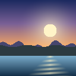

# Plixar Shaders

A realistic shaderpack for **Minecraft: Java Edition** (OptiFine / Iris).
Soft shadows, an atmospheric procedural sky, reflective water, volumetric
light shafts, and a filmic post-processing stack — tuned to look nice and
run well.



## Features

- **Procedural sky** — analytic atmospheric scattering with a real sun & moon
  disc, sunset reddening, twinkling stars, and rain-aware grading.
- **Soft shadows** — distorted shadow map with PCF filtering and *colored*
  shadows (water and stained glass tint the sunlight instead of blocking it).
- **Realistic water** — animated waves, normal-mapped ripples, fresnel sky
  reflections, depth-based color, and a sharp sun glint.
- **Volumetric light (god rays)** — screen-space light shafts marched toward
  the sun, occluded by the world.
- **Atmospheric fog** — combined distance + height fog tinted toward the sun,
  plus underwater and lava tints.
- **Filmic post** — ACES tonemapping, bloom, exposure, saturation/split-tone
  grading, vignette, and dithering to kill banding.
- **Foliage & water animation** — grass, leaves, and plants sway in the wind
  (and harder in the rain), with matching shadows.
- **In-game settings GUI** — POTATO / BALANCED / ULTRA profiles plus sliders
  for nearly everything (sun intensity, shadow softness, fog density, god-ray
  quality, bloom, exposure, …).

## Install

1. Install **[Iris](https://irisshaders.dev/)** (recommended, modern) **or**
   **[OptiFine](https://optifine.net/)** for your Minecraft version.
2. Open the game → **Options → Video Settings → Shaders** (OptiFine) or the
   **Shader Packs** screen (Iris).
3. Click **Open Shader Pack Folder**.
4. Copy the **`Plixar Shaders`** folder (the one containing `shaders/`) into
   that folder. *Or* zip it so the archive contains `shaders/` at its root and
   drop the `.zip` in.
5. Select **Plixar Shaders** in the list and apply.

> Requires a GPU that supports OpenGL 2.1+ / GLSL 1.20 (essentially anything
> from the last decade).

## Tuning

Open the shader options screen in-game:

| Profile     | What it does                                              |
|-------------|-----------------------------------------------------------|
| **POTATO**  | Shadows / god rays / bloom / reflections off — max FPS.   |
| **BALANCED**| Everything on at sensible quality (default).              |
| **ULTRA**   | Higher shadow softness, refraction, 48-sample god rays.   |

Individual sliders live under **Lighting**, **Water**, **Atmosphere**,
**Post-Processing**, and **Shadow Tuning**.

## Repo layout

```
shaders/
  shaders.properties      pipeline options, GUI layout, profiles
  pack.png                selector thumbnail
  lang/en_US.lang         GUI labels & tooltips
  lib/                    shared GLSL includes
    common.glsl           settings defaults, buffer formats, helpers
    uniforms.glsl         shared uniform/sampler declarations
    space.glsl            screen/view/world/shadow space conversions
    sky.glsl              procedural sky + time-of-day color
    shadows.glsl          PCF + colored shadow sampling
  gbuffers_*.{vsh,fsh}    geometry passes (terrain, water, sky, textured)
  shadow.{vsh,fsh}        shadow map render
  deferred.{vsh,fsh}      deferred lighting of opaque geometry
  composite.{vsh,fsh}     fog + god rays + water/lava tint
  composite1.{vsh,fsh}    bloom bright-pass + blur
  final.{vsh,fsh}         tonemap + grade + vignette + dither
tools/
  check_shaders.py        static sanity checker (includes, braces, DRAWBUFFERS)
  make_pack_png.py        regenerates the thumbnail
```

## Development

Run the static checker after editing any GLSL — it resolves `#include`s and
catches unbalanced braces, broken includes, and DRAWBUFFERS mismatches before
you launch the game:

```sh
py tools/check_shaders.py
```

It is not a full GLSL compiler; for that, load the pack in-game and watch the
Iris/OptiFine log for shader compile errors.
